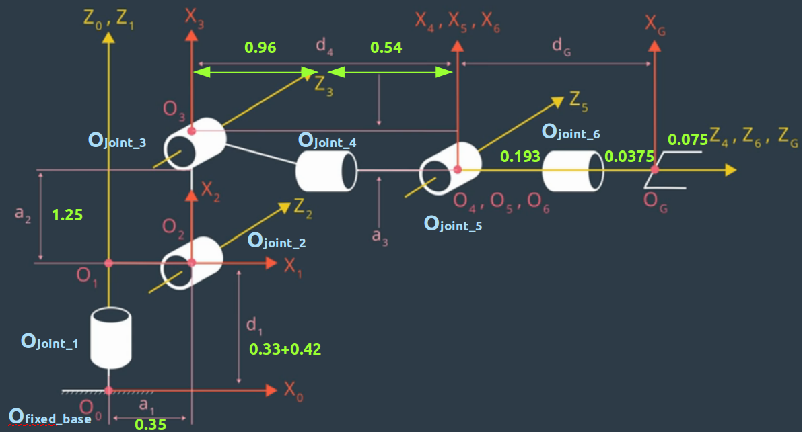
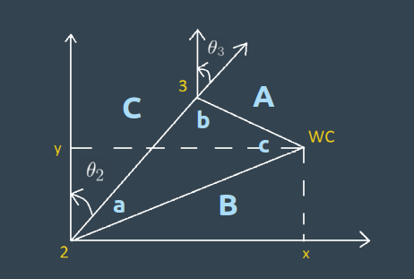
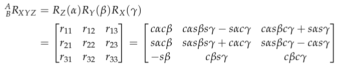

## Project: Kinematics Pick & Place
### Writeup Template: You can use this file as a template for your writeup if you want to submit it as a markdown file, but feel free to use some other method and submit a pdf if you prefer.

---


**Steps to complete the project:**  


1. Set up your ROS Workspace.
2. Download or clone the [project repository](https://github.com/udacity/RoboND-Kinematics-Project) into the ***src*** directory of your ROS Workspace.  
3. Experiment with the forward_kinematics environment and get familiar with the robot.
4. Launch in [demo mode](https://classroom.udacity.com/nanodegrees/nd209/parts/7b2fd2d7-e181-401e-977a-6158c77bf816/modules/8855de3f-2897-46c3-a805-628b5ecf045b/lessons/91d017b1-4493-4522-ad52-04a74a01094c/concepts/ae64bb91-e8c4-44c9-adbe-798e8f688193).
5. Perform Kinematic Analysis for the robot following the [project rubric](https://review.udacity.com/#!/rubrics/972/view).
6. Fill in the `IK_server.py` with your Inverse Kinematics code. 


[//]: # "Image References"

[image1]: ./misc_images/misc1.png
[image2]: ./misc_images/misc3.png
[image3]: ./misc_images/misc2.png

## [Rubric](https://review.udacity.com/#!/rubrics/972/view) Points
### Here I will consider the rubric points individually and describe how I addressed each point in my implementation.  

---
### Writeup / README

#### 1. Provide a Writeup / README that includes all the rubric points and how you addressed each one.  You can submit your writeup as markdown or pdf.  

You're reading it!

### Kinematic Analysis
#### 1. Run the forward_kinematics demo and evaluate the kr210.urdf.xacro file to perform kinematic analysis of Kuka KR210 robot and derive its DH parameters.

#### 1.1 Basic Information

- That files `~RoboND-Kinematics-Project/kuka_arm/urdf/kr210.urdf.xacro`contains the robot specification, such as links and joints sizes, types, connections, etc.

- Take `joint_1` as an example, 

  ```html
   <joint name="joint_1" type="revolute">
      <origin xyz="0 0 0.33" rpy="0 0 0"/>
      <parent link="base_link"/>
      <child link="link_1"/>
      <axis xyz="0 0 1"/>
      <limit lower="${-185*deg}" upper="${185*deg}" effort="300" velocity="${123*deg}"/>
    </joint>
  ```

  - The offset position is $(0, 0, 0.33)$
  - The type of `joint_1` is revolute

#### 1.2 Kinematic Analysis

-  The following table shows the derived Denavit-Hartenberg Parameters 

  

- For $i =1​$

  - $d_1=0.33+0.42=0.75$
  - $Z_0$ and $Z_1$ are collinear, so $\alpha_0=0,\ a=0$

- For $i =2$

  - $a_1=0.35$, according to URDF file
  - $X_1$ and $X_2$ are coincident, $d_2=0$
  - $Z_2$ relates to $Z_1$ is  $\alpha_1=-90$
  - $X_2$ relates to $X_1$ is  $-90$

- For $i =3$

  - $a_2=1.25$, according to URDF file
  - $X_3$ and $X_2$ are coincident, $d_2=0$
  - $Z_3$ and $Z_2$ are parallel  $\alpha_2=0$

- For $i =4$

  - $a_3=0.054$, according to URDF file
  - $d_4=0.96+0.54=1.5$
  - $Z_4$ relates to $Z_3$ are  $\alpha_3=90$

- For $i =5$

  - $Z_5​$ and $Z_4​$ are intersected,  $a_4=0​$
  - $X_5$ and $X_4$ are coincident, $d_5=0$
  - $Z_5$ relates to $Z_4$ are  $\alpha_4=90$

- For $i =6$

  - $Z_6$ and $Z_5$ are intersected,  $a_5=0$
  - $X_5$ and $X_4$ are coincident, $d_6=0$
  - $Z_6$ relates to $Z_5$ are  $\alpha_4=-90$

- For $i =G\ \text{or}\ i=7$

  - $Z_6$ and $Z_G$ are collinear,  $a_6=0,\alpha_6=0$
  - $X_7=0.303$, according to URDF file

| i    | Links | alpha(i-1) | a(i-1) | d(i)  | theta(i) |
| ---- | ----- | ---------- | ------ | ----- | -------- |
| 1    | 0->1  | 0          | 0      | 0.75  | q1       |
| 2    | 1->2  | - pi/2     | 0.35   | 0     | q2-pi/2  |
| 3    | 2->3  | 0          | 1.25   | 0     | q3       |
| 4    | 3->4  | - pi/2     | -0.054 | 1.50  | q4       |
| 5    | 4->5  | pi/2       | 0      | 0     | q5       |
| 6    | 5->6  | - pi/2     | 0      | 0     | q6       |
| 7    | 6->EE | 0          | 0      | 0.303 | q7       |

- In the constructor of the  `InverseKinematicSolver` class the DH-Parameters are stored as dictionary like this

  ```python
  self.q1, self.q2, self.q3, self.q4, self.q5, self.q6, self.q7 = symbols('q1:8') #joints
  self.d1, self.d2, self.d3, self.d4, self.d5, self.d6, self.d7 = symbols('d1:8') #link offsets
  self.a0, self.a1, self.a2, self.a3, self.a4, self.a5, self.a6 = symbols('a0:7') #link length
  self.alpha0, self.alpha1, self.alpha2, self.alpha3, self.alpha4, self.alpha5, self.alpha6 = symbols('alpha0:7') #twist angles 
  self.r, self.p, self.y = symbols('r p y')

  # DH Parameters dictionary
  self.dh_param = {self.alpha0:      0,      self.a0:     0,      self.d1:     0.75,       self.q1:     self.q1,      
                   self.alpha1:     -pi/2.,  self.a1:     0.35,   self.d2:     0,          self.q2:     self.q2-pi/2,            
                   self.alpha2:      0,      self.a2:     1.25,   self.d3:     0,          self.q3:     self.q3,      
                   self.alpha3:      -pi/2., self.a3:     -0.054, self.d4:     1.50,       self.q4:     self.q4,      
                   self.alpha4:      pi/2,   self.a4:     0,      self.d5:     0,          self.q5:     self.q5,      
                   self.alpha5:      -pi/2., self.a5:     0,      self.d6:     0,          self.q6:     self.q6,      
                   self.alpha6:      0,      self.a6:     0,      self.d7:     0.303,      self.q7:     0}
  ```

  ​

#### 2. Using the DH parameter table you derived earlier, create individual transformation matrices about each joint. In addition, also generate a generalized homogeneous transform between base_link and gripper_link using only end-effector(gripper) pose.

#### 2.1 Transformation Matrices

- The Transformation Matrix with Parameters

  ```python
  self.T0_1 = self.transformation_matrix(self.alpha0, self.a0, self.d1, self.q1).subs(self.dh_param)
          self.T1_2 = self.transformation_matrix(self.alpha1, self.a1, self.d2, self.q2).subs(self.dh_param)
          self.T2_3 = self.transformation_matrix(self.alpha2, self.a2, self.d3, self.q3).subs(self.dh_param)
          self.T3_4 = self.transformation_matrix(self.alpha3, self.a3, self.d4, self.q4).subs(self.dh_param)
          self.T4_5 = self.transformation_matrix(self.alpha4, self.a4, self.d5, self.q5).subs(self.dh_param)
          self.T5_6 = self.transformation_matrix(self.alpha5, self.a5, self.d6, self.q6).subs(self.dh_param)
          self.T6_TCP = self.transformation_matrix(self.alpha6, self.a6, self.d7, self.q7).subs(self.dh_param)
  ```

- Define the `transformation_matrix` function

  ```python
  @staticmethod
  def transformation_matrix(alpha, a, d, q):
      return Matrix([[cos(q),                       -sin(q),             0,              a],
                     [sin(q)*cos(alpha),  cos(q)*cos(alpha),   -sin(alpha),  -sin(alpha)*d],
                     [sin(q)*sin(alpha),  cos(q)*sin(alpha),    cos(alpha),   cos(alpha)*d],
                     [                0,                  0,             0,              1]])
  ```

  ​

#### 2.2 Homogeneous Transform

- From `base_link` to `gripper_link`, as the previous mentioned, it could be calculated by a chain of transformation matrices.

  ```
  T0_1 = [[cos(q1), -sin(q1), 0, 0],
         [sin(q1), cos(q1), 0, 0],
         [0, 0, 1, 0.75],
         [0, 0, 0, 1]]
     
  T1_2 = [[cos(q2 - 0.5*pi), -sin(q2 - 0.5*pi), 0, 0.35],
         [0, 0, 1, 0],
         [-sin(q2 - 0.5*pi), -cos(q2 - 0.5*pi), 0, 0],
         [0, 0, 0, 1]]
     
  T2_3 = [[cos(q3), -sin(q3), 0, 1.25],
         [sin(q3), cos(q3), 0, 0],
         [0, 0, 1, 0],
         [0, 0, 0, 1]]
      
  T3_4 = [[cos(q4), -sin(q4), 0, -0.054],
          [0, 0, 1, 1.5],
          [-sin(q4), -cos(q4), 0, 0],
          [0, 0, 0, 1]]
      
   T4_5 = [[cos(q5), -sin(q5), 0, 0],
          [0, 0, -1, 0],
          [sin(q5), cos(q5), 0, 0],
          [0, 0, 0, 1]]
      
   T5_6 = [[cos(q6), -sin(q6), 0, 0],
          [0, 0, 1, 0],
          [-sin(q6), -cos(q6), 0, 0],
          [0, 0, 0, 1]]
      
   T6_7 = [[1, 0, 0, a6],
          [0, 1, 0, 0],
          [0, 0, 1, 0.303],
          [0, 0, 0, 1]
  ```

  ​

- The final matrix can be calculated by

  ```python
  self.TBASE_TCP = self.T0_1 * self.T1_2 * self.T2_3 * self.T3_4 * self.T4_5 * self.T5_6 * self.T6_TCP 
  ```

- Considering the difference between the URDF file and DH convention

  ```python
  self.ROT_TCP = self.rot_z(self.y) * self.rot_y(self.p) * self.rot_x(self.r)
          self.ROT_Error = self.rot_z(self.y).subs(self.y, radians(180)) * self.rot_y(self.p).subs(self.p, radians(-90))
          self.ROT_TCP = self.ROT_TCP * self.ROT_Error
  ```

  ​


#### 3. Decouple Inverse Kinematics problem into Inverse Position Kinematics and inverse Orientation Kinematics; doing so derive the equations to calculate all individual joint angles.

#### 3.1 Get the inverse position

- The last three joints, `joint_4`, `joint_5` and `joint_6`, are intersect in the same point, so this is a spherical wrist.

- Based on current px, py, pz and DH parameters, the center of the wrist is

  ```python
  self.ROT_TCP = self.ROT_TCP.subs({'r': roll, 'p': pitch, 'y': yaw})

  self.TCP = Matrix([[px],
                     [py],
                     [pz]])

  # calculate the wrist center
  self.WC = self.TCP - (self.dh_param.get(self.d7) * self.ROT_TCP[:,2])
  ```

#### 3.2 Calculate the joint angle

- According to the image, 

  

  we could get the formula

  $c^2=a^2+b^2-2ab\cdot\cos(\gamma)$

  So the a, b, c, x, y are calculated by

  ```python
  x = sqrt(self.WC[0]*self.WC[0] + self.WC[1]*self.WC[1]) - self.dh_param.get(self.a1)
  y = self.WC[2] - self.dh_param.get(self.d1)

  a = round(sqrt(self.dh_param.get(self.d4)**2 + self.dh_param.get(self.a3)**2), 4)
  b = sqrt(x**2 + y**2)
  c = self.dh_param.get(self.a2)
  ```

- The next step is to $\theta_1$、$\theta_2$ and $\theta_3$

  ```python
  error = abs(self.dh_param.get(self.a3)) / self.dh_param.get(self.d4)
  alpha = acos((b**2 + c**2 - a**2) / (2*b*c))
  beta = acos((a**2 + c**2 - b**2) / (2*a*c))
  gamma = acos((a**2 + b**2 - c**2) / (2*a*b))

  # get the thetas with help of alpha, beta, gamma
  theta1 = atan2(self.WC[1], self.WC[0])
  theta2 = pi/2 - alpha - atan2(y, x)
  theta3 = pi/2 - beta - error

  ```

#### 3.3 Inverse Orientation

Based on $\theta_1$、$\theta_2$ and $\theta_3$, we can get the other three angles. The calculation is based on the 



- Calculate the partial rotation matrix first

  ```python
  R0_3 = self.T0_1[0:3,0:3] * self.T1_2[0:3,0:3] * self.T2_3[0:3,0:3]
  R0_3 = R0_3.evalf(subs={self.q1: theta1, self.q2: theta2, self.q3: theta3})
  R3_6 = R0_3.transpose() * self.ROT_TCP
  ```

- There might be more than one solution available, we need to check the `sin` value, then decide the final solution.

  ```python
  theta5 = atan2(sqrt(R3_6[0,2]*R3_6[0,2] + R3_6[2,2]*R3_6[2,2]), R3_6[1,2])
  if sin(theta5) < 0:
  	theta4 = atan2(-R3_6[2,2], R3_6[0,2])
      theta6 = atan2(R3_6[1,1], -R3_6[1,0])
  else:	
      theta4 = atan2(R3_6[2,2], -R3_6[0,2])
      theta6 = atan2(-R3_6[1,1], R3_6[1,0])
  ```

  ​


### Project Implementation

#### 1. Fill in the `IK_server.py` file with properly commented python code for calculating Inverse Kinematics based on previously performed Kinematic Analysis. Your code must guide the robot to successfully complete 8/10 pick and place cycles. Briefly discuss the code you implemented and your results. 

#### 1.1 Implementation

- For convenience, I separated the service feedback and inverse calculation separately by `IK_server.py` and `IK_solver.py`

- In `IK_server.py`, we should check the `req` information firstly

  ```python
   rospy.loginfo("Received %s eef-poses from the plan" % len(req.poses))
      if len(req.poses) < 1:
          print "No valid poses received"
          return -1
      else:
  ```

- Then, initialize the `Solver`

  ```python
  Solver = InverseKinematicSolver()
  ```

- Next,  according the poses, we need to calculate one by one, transferring the quaternion to roll, pitch and yaw 

  ```python
  joint_trajectory_list = []
          for x in xrange(0, len(req.poses)):
              joint_trajectory_point = JointTrajectoryPoint()
              px = req.poses[x].position.x
              py = req.poses[x].position.y
              pz = req.poses[x].position.z
  	
              (roll, pitch, yaw) = tf.transformations.euler_from_quaternion(
                  [req.poses[x].orientation.x, req.poses[x].orientation.y,
                      req.poses[x].orientation.z, req.poses[x].orientation.w])      
  ```

- In this `for` loop, implement the inverse kinematic calculation

  ```python
  theta1, theta2, theta3, theta4, theta5, theta6 = Solver.calculate_angles(px, py, pz, roll, pitch, yaw)
  joint_trajectory_point.positions = [theta1, theta2, theta3, theta4, theta5, theta6]
  joint_trajectory_list.append(joint_trajectory_point)
  ```

- Then return the list

  ```python
  return CalculateIKResponse(joint_trajectory_list)
  ```

  ​

#### 1.2 `staticmethod` Tip

We could use `@staticmehtod` to define the function-like method to make the codes more easily to understand

```python
@staticmethod
def transformation_matrix(alpha, a, d, q):
    return Matrix([[cos(q),                       -sin(q),             0,              a],
                   [sin(q)*cos(alpha),  cos(q)*cos(alpha),   -sin(alpha),  -sin(alpha)*d],
                   [sin(q)*sin(alpha),  cos(q)*sin(alpha),    cos(alpha),   cos(alpha)*d],
                   [                0,                  0,             0,              1]])

@staticmethod    
def rot_x(q):
    return Matrix([ [1,        0,       0],
                   [0,   cos(q), -sin(q)],
                   [0,   sin(q),  cos(q)]])

@staticmethod
def rot_y(q):
    return Matrix([ [cos(q),   0,   sin(q)],
                   [0,        1,        0],
                   [-sin(q),  0,   cos(q)]])  
@staticmethod    
def rot_z(q):
    return Matrix([ [cos(q),  -sin(q), 0],
                   [sin(q),   cos(q), 0],
                   [0,             0, 1]])
```

#### 1.3 Result

- The proposed method could finish the pick and drop assignment correctly, 8/10 cylinders are successfully dropped into the recycle bin.
- The trajectories generated by MoveIt is not optimal enough, so sometimes it takes a long time for the arm moving from one place to the other.


- There is one problem that in some cases cylinder was dropped during the movement when the gripper is turning.


